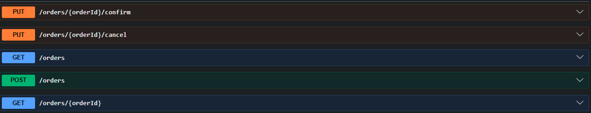
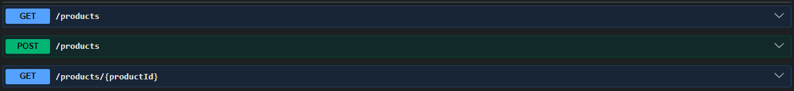
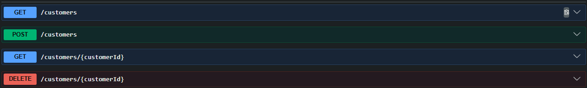
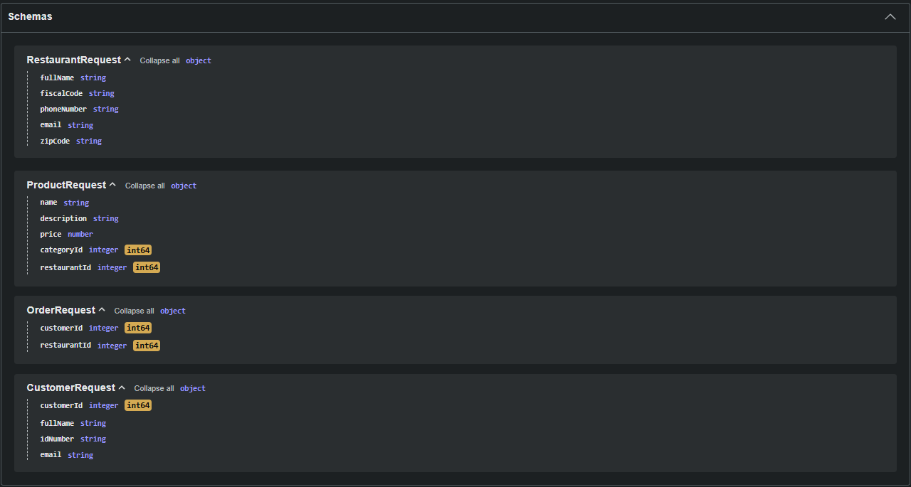
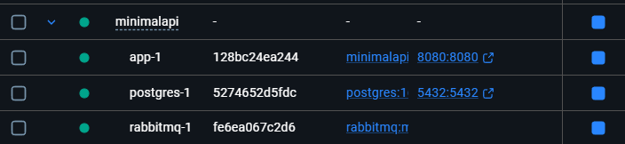
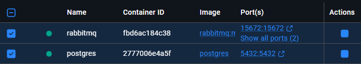

# 🛵 DeliveryFlow API

A backend REST API for a multi-restaurant delivery platform, built as a learning project while studying Java and Spring Boot. The goal is to simulate a real-world system similar to iFood or Anota.ai, covering the full order lifecycle from creation to delivery.

> ⚠️ **This is a study project.** I'm a Java junior developer actively learning and evolving this codebase. Feedback and suggestions are welcome!

---

## 📌 About the Project

This API manages orders, customers, restaurants, and products in a delivery context. It uses asynchronous messaging to handle order confirmation events and follows a layered architecture (Controller → Service → Repository).

The project started as a minimal order processing API and is being progressively expanded into a full delivery platform.

---

## 🚀 Tech Stack

| Technology | Version | Purpose |
|---|---|---|
| Java | 17 | Language |
| Spring Boot | 4.0.3 | Framework |
| Spring Doc | 3.0.2 | API Documentation |
| Spring Data JPA | — | ORM / Database access |
| Spring AMQP | — | RabbitMQ messaging |
| Flyway | 11.x | Database migrations |
| PostgreSQL | 16 | Relational database |
| RabbitMQ | 4.x | Message broker |
| Lombok | — | Boilerplate reduction |
| Docker / Docker Compose | — | Containerization |
| Gradle | — | Build tool |

> ⚠️ **Note:** Version **3.0.2** of **Spring Doc** is currently the only one compatible with **Spring Boot 4.0.3**.
>
> However, it introduces transitive dependencies with known security vulnerabilities:
> - `com.fasterxml.jackson.core:jackson-core:2.20.2` - https://www.mend.io/vulnerability-database/GHSA-72hv-8253-57qq/
> - `tools.jackson.core:jackson-core:3.0.4` - https://www.mend.io/vulnerability-database/CVE-2026-29062/
>
> These are associated with **GHSA-72hv-8253-57qq** and **CVE-2026-29062 (CVSS 7.5)**, which describes a nesting depth constraint bypass in `UTF8DataInputJsonParser`, potentially leading to resource exhaustion.
>
> ⚠️ **<span style="color: #ff4d4f;"><strong> Use with caution in production environments and monitor for patched releases.</strong></span>**

---

## 📦 Domain Model

```
Customer ──< Order >── Restaurant
                │
                └──< OrderItem >── Product ──> ProductCategory
```

### Entities
- **Customer** — platform users who place orders
- **Restaurant** — establishments with products and order management
- **Product** — menu items with price, description, and category
- **ProductCategory** — flexible category system (e.g. Sushi, Burger, Pizza)
- **Order** — the order itself, linked to customer and restaurant
- **OrderItem** — individual items within an order, with quantity and unit price at the time of purchase

### Order Status Flow
```
CREATED → PENDING → CONFIRMED → PREPARING → READY → DISPATCHED → DELIVERED
             └──> CANCELLED                                              
```

---

## 🔁 Messaging (RabbitMQ)

When an order is confirmed (`PUT /orders/{id}/confirm`), an event is published to RabbitMQ:
*I know...Its basic! Someday i'll focus on bring more functionalities, like SMS or E-mail notifications through another application that reads the queue of orders Cancelled or Confirmed.*
- **Exchange:** `exchange1` (TopicExchange)
- **Queue:** `queue1`
- **Routing Key:** `order.confirmed`
- **Consumer:** logs the event and simulates a notification to the customer

---
## 🖧  Database Diagram

## 🗄️ Database Migrations (Flyway)

| Version | Description |
|---|---|
| V1 | Create `tb_customers` table |
| V2 | Create `tb_orders` table |
| V3 | Create `tb_restaurants` table |
| V4 | Create `tb_product_categories` table |
| V5 | Create `tb_products` table |
| V6 | Create `tb_order_items` table |
| V7 | Add `restaurant_id` FK to `tb_orders` |

---

## 🌐 API Endpoints

### Orders


### Restaurants

`/restaurants/{id}/orders` | paginated, 10 per page "*because i want*"😂 |

### Products


### Customers


## API Schemas



---

## 🐳 Running the Project

### Option 1 — Full Docker Compose (recommended)

Runs the application, PostgreSQL, and RabbitMQ together in containers.

```bash
# Clone the repository
git clone https://github.com/viniciuspaim/deliveryflowapi.git
cd deliveryflowapi

# Create the .env file with your credentials
cp .env.example .env

# Start all services
docker compose up --build

```


The API will be available at `http://localhost:8080`.

> 💡 The `docker-compose.yml` uses a healthcheck on RabbitMQ so the app only starts after the broker is fully ready.

---

### Option 2 — Local development (IntelliJ + separate containers)

This is how I run the project during development. PostgreSQL and RabbitMQ run as individual Docker containers, and the Spring Boot app runs directly from the IDE.

**1. Start the infrastructure containers:**

```bash
# PostgreSQL
docker run -d --name postgres -p 5432:5432 \
  -e POSTGRES_PASSWORD=postgres \
  -e POSTGRES_DB=deliveryflowdb \
  postgres:16

# RabbitMQ
docker run -d --name rabbitmq -p 5672:5672 -p 15672:15672 \
  rabbitmq:management
```


**2. Configure environment variables in IntelliJ:**

Go to `Run → Edit Configurations → Modify Options → Environment Variables` and add:

```
POSTGRES_USER=postgres;POSTGRES_PASSWORD=postgres;RABBITMQ_USER=guest;RABBITMQ_PASSWORD=guest
```

**3. Run the application** from IntelliJ normally.

The RabbitMQ management panel is available at `http://localhost:15672` (user: `guest`, password: `guest`).

---

### Environment Variables

Create a `.env` file in the project root (never commit this file):

```env
POSTGRES_USER=postgres
POSTGRES_PASSWORD=postgres
POSTGRES_DB=deliveryflowdb
RABBITMQ_USER=guest
RABBITMQ_PASSWORD=guest
```

> A `.env.example` file is provided as a template.

---

## 🔒 Security Note

Credentials are managed via environment variables with my Intellij, keep in mind, these credentials above are examples. The `.env` file is listed in `.gitignore` and is never committed to the repository.

---

## 🗺️ Roadmap

- [x] Order lifecycle management (create, confirm, cancel)
- [x] Customer and Restaurant entities
- [x] Asynchronous messaging with RabbitMQ
- [x] Database migrations with Flyway
- [x] Full Dockerization with Docker Compose
- [x] Paginated order listing per restaurant
- [ ] Product and OrderItem CRUD
- [ ] JWT Authentication
- [ ] Unit and integration tests (JUnit + Testcontainers)
- [ ] Cloud deployment (Railway / Render / AWS)
- [ ] Order total calculation from OrderItems

---

## 👨‍💻 Author

**Vinícius Paim**
Java Backend Developer (Junior)
[LinkedIn](https://www.linkedin.com/in/vinicius-paim/) · [GitHub](https://github.com/viniciuspaim/)

## References for study

- Head First Java, 3nd Edition Book
- Baeldung - https://www.baeldung.com/java-clean-code
- Spring.io Docs - https://docs.spring.io/spring-amqp/docs/current/api/org/springframework/amqp/rabbit/annotation/RabbitListener.html
- Medium(Tutorial - Spring Boot e RabbitMQ) - https://medium.com/@thiagolenz/tutorial-spring-boot-e-rabbitmq-como-fazer-e-porqu%C3%AA-4a6cc34a3bd1
- RabbitMQ - https://www.rabbitmq.com/tutorials/tutorial-one-java